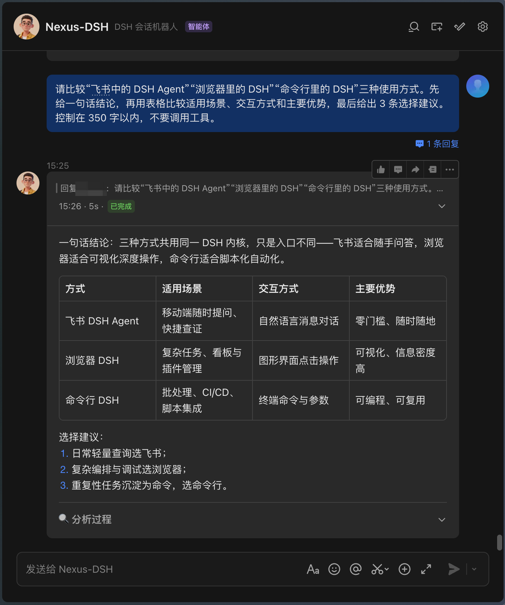
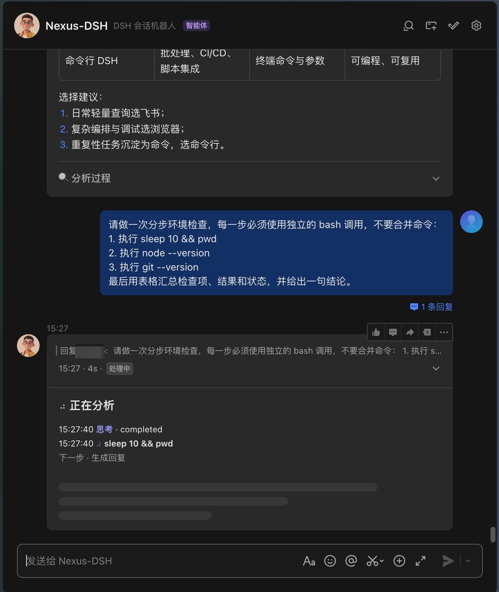
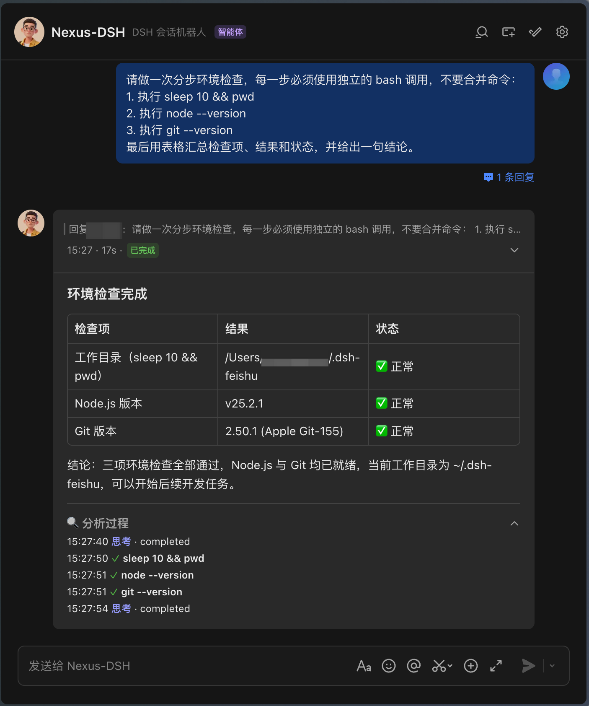
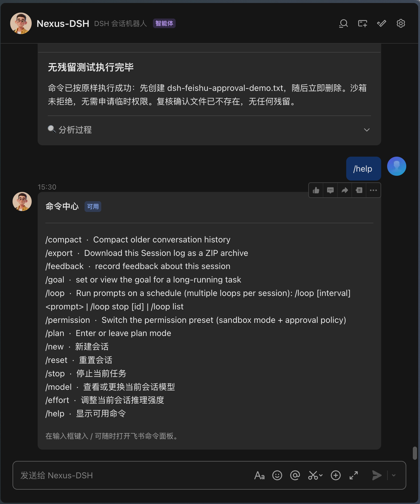
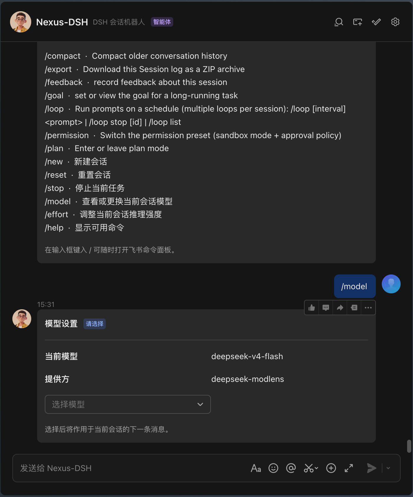

<h1 align="center">dsh-feishu-channel</h1>

<p align="center"><strong>把飞书变成 DSH 的遥控器</strong> —— 双向对话、流式富卡片、一键审批、扫码即用。</p>

<p align="center">
  
  
  
  <a href="https://github.com/whoisjiahao/dsh-feishu-channel/actions/workflows/gates.yml"></a>
</p>

> Feishu/Lark IM channel for [DeepSeek Harness](https://github.com/deepseek-ai/deepseek-harness)：在飞书聊天里直接驱动你的 DSH agent——每个私聊、群聊或话题都有自己的 agent，回复以流式富卡片回到飞书，工具权限问题变成按钮决策。

---

## 为什么用它

| 体验 | 说明 |
|---|---|
| ⚡ **扫码即用** | 零配置：启动时打印二维码，飞书一扫自动创建应用（含事件订阅与凭据持久化），30 秒开聊 |
| 🎴 **流式富卡片** | 每轮一张三态卡片原地更新：加载中实时步骤 → 结论优先正文 → 失败可重试；超限自动降级为原生消息 |
| 🔐 **一键审批** | 工具权限问题变成交互卡片，点「允许一次 / 拒绝」即决策，无需切窗口打字 |
| 🧭 **交互命令** | 裸命令自动变成选择、输入或确认卡；执行结果在原卡片结算，危险权限额外二次确认 |
| 🌐 **无需公网** | WebSocket 长连接，不需要公网 URL、回调地址或端口转发 |
| 🧵 **多会话** | 私聊 / 群聊 / 话题各自独立 agent，互不串台；`/new`、`/stop` 随时控制 |
| 🛡️ **安全默认** | 白名单门控、群内 @ 门控、密钥脱敏、拒绝静默——默认拒绝一切收窄之外的流量 |

## 快速开始

> **环境要求**：DeepSeek Harness 的 `dsh web`（本插件在 **0.1.1-rc.2** 主线上开发并实测，依赖宿主 agents / settings / commands 等核心服务，标准 dsh web 组合自带）；Node `^22.19.0 || >=24`。

**① 安装**（三选一，装进你的 web profile；命令即转发 pnpm，在 `~/.dsh/profiles/web` 内执行）：

```sh
# 已发布版本（需要对应 tag 已推送到 GitHub）
dsh plugin --profile web add github:whoisjiahao/dsh-feishu-channel#v0.8.0

# 或：从 GitHub Releases 下载 tgz 后本地安装（无需网络解析 git 引用）
dsh plugin --profile web add ~/Downloads/dsh-feishu-channel-0.8.0.tgz

# 或：开发模式——链接本仓库，pnpm build 后热重载即可见
dsh plugin --profile web add file:/绝对路径/dsh-feishu-channel
```

**② 重启 dsh web**，启动日志出现二维码：

```
feishu-channel: 请用飞书扫码创建应用…
```

**③ 扫码**：用飞书 App 扫描二维码，确认创建应用——凭据自动保存，下次启动直连，无需再扫。

**④ 开聊**：在飞书里给机器人发第一条消息（群聊记得 @ 它）。

> 已有企业应用凭据？直接写在 profile 的 `cordis.patch.yml`：
>
> ```yaml
> - insert:
>     - id: feishu-channel
>       name: dsh-feishu-channel
>       config:
>         appId: cli_xxx
>         appSecret: xxx
> ```
>
> 或用环境变量管理凭据：运行 `node scripts/register-lark-app.mjs` 走官方扫码注册，把产出的 `FEISHU_APP_ID / FEISHU_APP_SECRET` 填入 patch 的 `appId: !!js process.env.FEISHU_APP_ID`（`!!js`，不是 `!js`）。

> 🤖 你是 AI agent？跳到 [Agent 安装指引](#agent-安装指引机器可执行)——每步带命令与完成标志，可直接执行。

## Agent 安装指引（机器可执行）

目标读者：AI agent 与自动化脚本。按序执行，每步给出完成标志；任一步失败即停，不要自行变通。以下 `$PROFILE` 默认 `web`。

**步骤 0 · 前置检查**

```sh
node -v   # 必须满足 ^22.19.0 || >=24.0.0
test -f ~/.dsh/profiles/$PROFILE/package.json && echo profile-ok
```

**步骤 1 · 安装包体（二选一）**

```sh
# A. 发布版（要求 GitHub 存在 v0.7.1 tag；未发布则用 B）
dsh plugin --profile $PROFILE add github:whoisjiahao/dsh-feishu-channel#v0.8.0
# B. 本地 tgz（从 Releases 资产下载，或仓库内 pnpm pack 产出）
dsh plugin --profile $PROFILE add /绝对路径/dsh-feishu-channel-0.8.0.tgz
```

完成标志：`~/.dsh/profiles/$PROFILE/package.json` 的 `dependencies` 出现 `"dsh-feishu-channel"`。

**步骤 2 · 装配确认（三处，缺一不可）**

1. `package.json` → `dsh.profile.bundles` 数组包含 `"dsh-feishu-channel"`（没有就手动加一行）；
2. 凭据二选一：`~/.dsh/settings.yaml` 的 `feishu-channel:` 段（`appId`/`appSecret`），或 profile `cordis.patch.yml` 的 `insert` 行（模板见上文快速开始）；两者都缺 → 首次启动进入扫码流程，也算合法路径；
3. `node -e "console.log(require('$HOME/.dsh/profiles/$PROFILE/node_modules/dsh-feishu-channel/package.json').version)"` 输出预期版本。

**步骤 3 · 重启并验证**

重启 dsh web 后，日志必须出现授权声明行：

```
feishu-channel: direct messages: anyone the app is visible to (narrow with senderAllowlist); groups: ...
```

冒烟测试：在飞书向机器人发送任意消息 → 收到流式卡片（加载 → 完成/失败三态之一）即成功。

**回滚**

```sh
dsh plugin --profile $PROFILE remove dsh-feishu-channel
# 并从 package.json 的 dsh.profile.bundles 数组移除 "dsh-feishu-channel"，然后重启。
```

## 界面预览

以下均为真实飞书客户端截图，敏感路径已遮盖。

### 回复卡片

结论优先呈现，支持表格、编号列表与默认收起的分析过程。

<p align="center">
  
</p>

### 命令执行

同一张卡片从处理中原地更新为完成态，并保留清晰、可核对的执行时间线。

<table>
  <tr>
    <td width="50%" align="center"><strong>执行中</strong></td>
    <td width="50%" align="center"><strong>已完成</strong></td>
  </tr>
  <tr>
    <td valign="top"></td>
    <td valign="top"></td>
  </tr>
</table>

### 命令控制

命令中心与会话设置均使用原生交互控件，无需记忆参数或离开聊天窗口。

<table>
  <tr>
    <td width="50%" align="center"><strong>命令中心</strong></td>
    <td width="50%" align="center"><strong>模型设置</strong></td>
  </tr>
  <tr>
    <td valign="top"></td>
    <td valign="top"></td>
  </tr>
</table>

## 常用配置

| 字段 | 默认 | 说明 |
|---|---|---|
| appId / appSecret | — | 应用凭据；不填则扫码注册 |
| domain | open.feishu.cn | 开放平台域名（国际版用 open.larksuite.com） |
| provider / model | 宿主默认 | 聊天 agent 的模型路由 |
| sessionScope | chat | 会话面：chat / chat-thread（话题）/ chat-sender（按发送者） |
| requireMention | true | 群聊必须 @ 才响应 |
| senderAllowlist | [] | 私聊白名单（ou_…）；空 = 平台可见者皆可 |
| groupAllowlist | [] | 群白名单（oc_…）；空 = 任何被拉入的群 |
| approvers | [] | 审批点击者白名单；空 = 能驱动该聊天者皆可 |

<details>
<summary>完整配置表（渲染细节等）</summary>

| 字段 | 默认 | 说明 |
|---|---|---|
| cwd | `~/.dsh-feishu` | agent 会话工作目录；不存在时自动创建 |
| preset | 宿主默认 | 聊天 agent 加入的 preset |
| showProcess | true | 是否展示加载进度与完成态工具动作时间线（不展示原始 reasoning） |
| syncSlashCommands | true | 同步命令到飞书斜杠面板 |
| denyTools | ask_user_question, exit_plan_mode | 聊天 agent 禁用的工具（答案无法到达聊天的工具） |
| footerFields | 见源码 | 终态卡片展开详情字段（model/input/output tokens/cost/context） |
| pricing | 内置 DeepSeek 官方牌价 | 模型单价表（每百万 token）：默认已配好 `deepseek-v4-flash` / `deepseek-v4-flash-vision-exp` / `deepseek-v4-pro` 现行峰谷价；自定义条目按模型 id 与内置表合并，同名键整条覆盖。字段：`input`/`output` 高峰价、可选 `cacheHitInput` 缓存命中输入价（缺省按未命中价计，只会高估不会低估）、可选 `currency` 符号（默认 ¥）、可选 `offPeak: { input, output, cacheHitInput? }` 空闲档。配置后展开详情多一行「费用」，usage 落在空闲窗口内按折扣计并标「·低谷」，窗外按标准价计并标「·高峰」（未配分时价则不带档位标记） |
| offPeakWindows | DeepSeek 官方峰谷表 | 空闲时段窗口（北京时间 `HH:MM` 半开区间；end 早于 start 表示跨午夜）。默认按 DeepSeek 定价页：高峰为北京时间 9:00–12:00 与 14:00–18:00，其余为空闲（价格为高峰一半）；设为 `[]` 关闭分时计价 |
| maxTimelineItems | 12 | 时间线最大条目数 |
| tableOverflowMode | compact | 表格超限策略：compact（转字段列表）/ truncate（丢弃） |

</details>

## 命令

| 命令 | 作用 |
|---|---|
| `/new` | 新建空白会话 |
| `/reset` | 重置当前会话（与 /new 同义） |
| `/stop` | 停止当前任务 |
| `/model` | 查看或切换当前会话模型 |
| `/effort` | 查看或调整当前会话推理强度 |
| `/help` | 列出可用命令 |

直接发送裸命令会打开交互卡：有固定选项的命令显示下拉框，需要参数的命令显示输入框，无参数动作显示确认按钮。显式参数仍可直接执行，例如 `/feedback 卡片体验很好`。

其余 `/xxx` 来自当前 DSH 的宿主命令运行时，并按宿主描述自动进入同一套交互流程。`/permission` 的选项直接读取当前会话投影；切换到 `danger-full-access` 前必须再次确认。

## 安全

本插件让飞书消息驱动一个**有文件读写和 shell 权限的 agent**——它就是你的遥控器。默认拒绝一切收窄之外的流量：

- **生产部署务必设置** `senderAllowlist` / `groupAllowlist` / `approvers`，把遥控器交给该交的人
- 审批卡片展示工具名、将执行的命令与模型说明；所有动态文本先限长，命令和说明中的 token / secret / password / api-key 等先自动脱敏
- 点击必须同时匹配动作、原卡片、所在聊天、当前会话与允许的操作人；旧命令卡自动失效，同名 callId 在不同会话之间不会串用参数
- 拒绝入站保持静默：不向未授权者暴露边界事实
- 卸载即净：transport 断开、自有 agent 全部 dispose、挂起审批全部结算为 cancelled
- `ask_user_question` / `exit_plan_mode` 默认禁用：它们把提问弹到 `ctx.userQuestions` 的唯一注册方（通常是 dsh web 图形界面），飞书用户看不到也答不了，只会挂起到超时；禁用后模型会直接在聊天里用文字提问、用文字给计划。若你的部署以别处作答，可从 `denyTools` 移除

## 开发

```sh
pnpm install
pnpm gates        # typecheck + test + build + pack 冒烟 + 版本一致性（发布前必跑）
pnpm build        # tsc + tsdown，lib/ 提交进 git
```

组件组合测试将完整插件经 `apply` 挂到可控 transport 与 host 测试替身（`tests/harness.ts`），覆盖入站会话阶梯、授权拒绝、命令卡片、审批卡片全生命周期、富卡片渲染与失败重试、图片附加、斜杠面板同步、卸载清理与扫码注册流程。真实飞书客户端验收仍是发布前的独立步骤。

架构与设计决策见 [docs/DESIGN.md](docs/DESIGN.md)。

## 局限

- 配置只在启动时读取一次（patch 层与 settings 层都生效，后者优先），修改需重启
- chat agent 存活到插件卸载，无空闲驱逐
- 停机期间到达的消息不会重放（transport 无游标）
- 图片按**当前模型能力**决定是否透传，与 dsh web 图形界面同一门禁语义：会话模型声明支持图片输入即透传（无需任何配置）；模型不支持时机器人明确告知"当前模型不支持图片输入"，可 `/model` 切换视觉模型后重发；模型信息未知时放行、由路由做最终裁决。文件和音频以 SDK 标准化文本透传给模型
- 模型询问类工具（`ask_user_question` / `exit_plan_mode`）被禁用而非以卡片作答

## License

MIT
