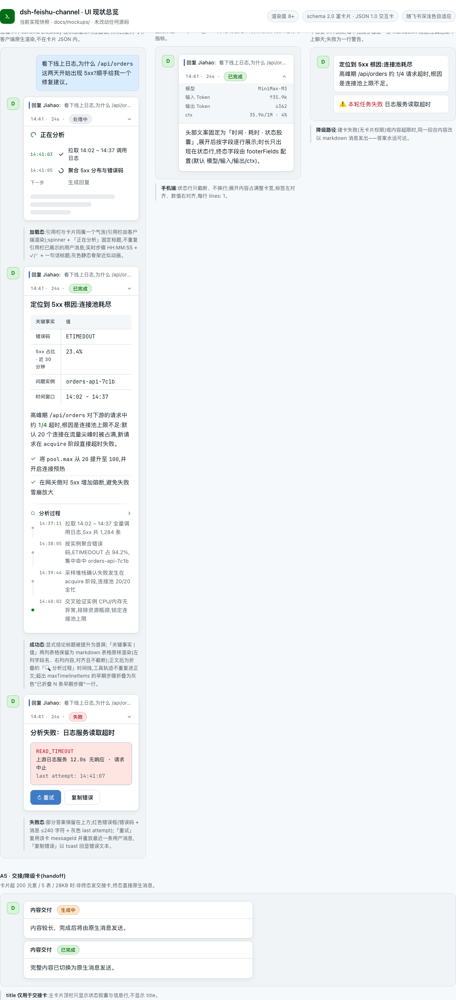
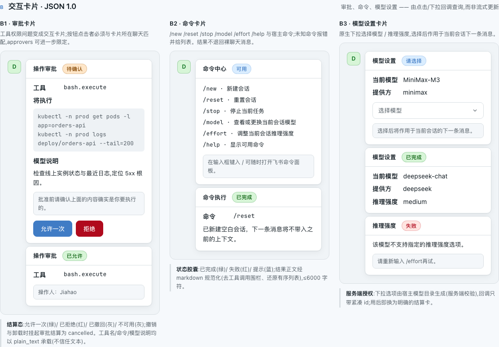
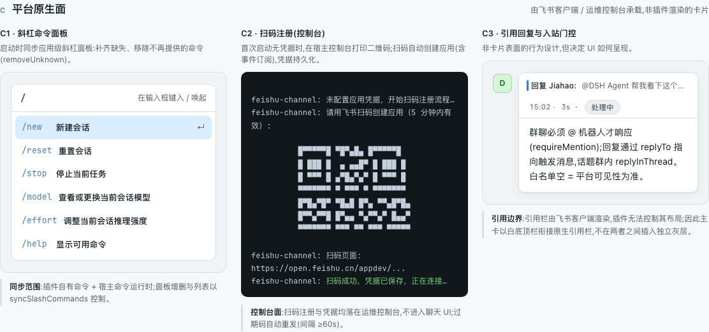

<h1 align="center">dsh-feishu-channel</h1>

<p align="center"><strong>把飞书变成 DSH 的遥控器</strong> —— 双向对话、流式富卡片、一键审批、扫码即用。</p>

<p align="center">
  
  
  
  <a href="https://github.com/whoisjiahao/dsh-feishu-channel/actions/workflows/gates.yml"></a>
</p>

> Feishu/Lark IM channel for [DeepSeek Harness](https://github.com/deepseek-ai/deepseek-harness)：在飞书聊天里直接驱动你的 DSH agent——每个私聊、群聊或话题都有自己的 agent，回复以流式富卡片回到飞书，工具权限问题变成按钮决策。

---

## 为什么用它

| 体验 | 说明 |
|---|---|
| ⚡ **扫码即用** | 零配置：启动时打印二维码，飞书一扫自动创建应用（含事件订阅与凭据持久化），30 秒开聊 |
| 🎴 **流式富卡片** | 每轮一张三态卡片原地更新：加载中实时步骤 → 结论优先正文 → 失败可重试；超限自动降级为原生消息 |
| 🔐 **一键审批** | 工具权限问题变成交互卡片，点「允许一次 / 拒绝」即决策，无需切窗口打字 |
| 🧭 **交互命令** | 裸命令自动变成选择、输入或确认卡；执行结果在原卡片结算，危险权限额外二次确认 |
| 🌐 **无需公网** | WebSocket 长连接，不需要公网 URL、回调地址或端口转发 |
| 🧵 **多会话** | 私聊 / 群聊 / 话题各自独立 agent，互不串台；`/new`、`/stop` 随时控制 |
| 🛡️ **安全默认** | 白名单门控、群内 @ 门控、密钥脱敏、拒绝静默——默认拒绝一切收窄之外的流量 |

## 快速开始

**① 安装**（装进你的 web profile）：

```sh
dsh plugin --profile web add github:whoisjiahao/dsh-feishu-channel#v0.3.0
```

**② 重启 dsh web**，启动日志出现二维码：

```
feishu-channel: 请用飞书扫码创建应用…
```

**③ 扫码**：用飞书 App 扫描二维码，确认创建应用——凭据自动保存，下次启动直连，无需再扫。

**④ 开聊**：在飞书里给机器人发第一条消息（群聊记得 @ 它）。

> 已有企业应用凭据？直接写在 profile 的 `cordis.patch.yml`：
>
> ```yaml
> - insert:
>     - id: feishu-channel
>       name: dsh-feishu-channel
>       config:
>         appId: cli_xxx
>         appSecret: xxx
> ```
>
> 或用环境变量管理凭据：运行 `node scripts/register-lark-app.mjs` 走官方扫码注册，把产出的 `FEISHU_APP_ID / FEISHU_APP_SECRET` 填入 patch 的 `appId: !!js process.env.FEISHU_APP_ID`（`!!js`，不是 `!js`）。

## 界面预览

**回复卡片**：加载中实时步骤 → 结论优先正文（关键事实表格 + 默认收起的证据）→ 失败重试：



**审批与命令卡片**：点按钮决策；命令可选择、输入或确认，结果在原卡片结算：



**平台原生面**：降级消息、斜杠命令面板、扫码注册入口：



## 常用配置

| 字段 | 默认 | 说明 |
|---|---|---|
| appId / appSecret | — | 应用凭据；不填则扫码注册 |
| domain | open.feishu.cn | 开放平台域名（国际版用 open.larksuite.com） |
| provider / model | 宿主默认 | 聊天 agent 的模型路由 |
| sessionScope | chat | 会话面：chat / chat-thread（话题）/ chat-sender（按发送者） |
| requireMention | true | 群聊必须 @ 才响应 |
| senderAllowlist | [] | 私聊白名单（ou_…）；空 = 平台可见者皆可 |
| groupAllowlist | [] | 群白名单（oc_…）；空 = 任何被拉入的群 |
| approvers | [] | 审批点击者白名单；空 = 能驱动该聊天者皆可 |

<details>
<summary>完整配置表（渲染细节等）</summary>

| 字段 | 默认 | 说明 |
|---|---|---|
| cwd | `~/.dsh-feishu` | agent 会话工作目录；不存在时自动创建 |
| preset | 宿主默认 | 聊天 agent 加入的 preset |
| showProcess | true | 是否展示加载进度与完成态工具动作时间线（不展示原始 reasoning） |
| attachImages | false | 是否把聊天图片传给模型（视觉路由才开） |
| syncSlashCommands | true | 同步命令到飞书斜杠面板 |
| denyTools | ask_user_question, exit_plan_mode | 聊天 agent 禁用的工具（答案无法到达聊天的工具） |
| footerFields | 见源码 | 终态卡片展开详情字段（model/input/output tokens/context） |
| maxTimelineItems | 12 | 时间线最大条目数 |
| tableOverflowMode | compact | 表格超限策略：compact（转字段列表）/ truncate（丢弃） |

</details>

## 命令

| 命令 | 作用 |
|---|---|
| `/new` | 新建空白会话 |
| `/reset` | 重置当前会话（与 /new 同义） |
| `/stop` | 停止当前任务 |
| `/model` | 查看或切换当前会话模型 |
| `/effort` | 查看或调整当前会话推理强度 |
| `/help` | 列出可用命令 |

直接发送裸命令会打开交互卡：有固定选项的命令显示下拉框，需要参数的命令显示输入框，无参数动作显示确认按钮。显式参数仍可直接执行，例如 `/feedback 卡片体验很好`。

其余 `/xxx` 来自当前 DSH 的宿主命令运行时，并按宿主描述自动进入同一套交互流程。`/permission` 的选项直接读取当前会话投影；切换到 `danger-full-access` 前必须再次确认。

## 安全

本插件让飞书消息驱动一个**有文件读写和 shell 权限的 agent**——它就是你的遥控器。默认拒绝一切收窄之外的流量：

- **生产部署务必设置** `senderAllowlist` / `groupAllowlist` / `approvers`，把遥控器交给该交的人
- 审批卡片展示工具名、将执行的命令与模型说明；所有动态文本先限长，命令和说明中的 token / secret / password / api-key 等先自动脱敏
- 点击必须同时匹配动作、原卡片、所在聊天、当前会话与允许的操作人；旧命令卡自动失效，同名 callId 在不同会话之间不会串用参数
- 拒绝入站保持静默：不向未授权者暴露边界事实
- 卸载即净：transport 断开、自有 agent 全部 dispose、挂起审批全部结算为 cancelled

## 开发

```sh
pnpm install
pnpm gates        # typecheck + test + build + pack 冒烟 + 版本一致性（发布前必跑）
pnpm build        # tsc + tsdown，lib/ 提交进 git
```

组件组合测试将完整插件经 `apply` 挂到可控 transport 与 host 测试替身（`tests/harness.ts`），覆盖入站会话阶梯、授权拒绝、命令卡片、审批卡片全生命周期、富卡片渲染与失败重试、图片附加、斜杠面板同步、卸载清理与扫码注册流程。真实飞书客户端验收仍是发布前的独立步骤。

架构与设计决策见 [docs/DESIGN.md](docs/DESIGN.md)。

## 局限

- 配置只在启动时读取一次（patch 层与 settings 层都生效，后者优先），修改需重启
- chat agent 存活到插件卸载，无空闲驱逐
- 停机期间到达的消息不会重放（transport 无游标）
- 文件和音频只以 SDK 标准化文本透传；图片是例外（默认关闭）
- 模型询问类工具（`ask_user_question` / `exit_plan_mode`）被禁用而非以卡片作答

## License

MIT
